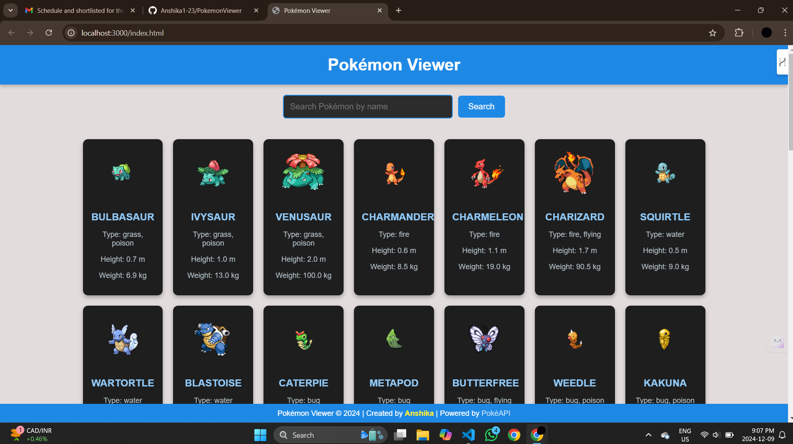
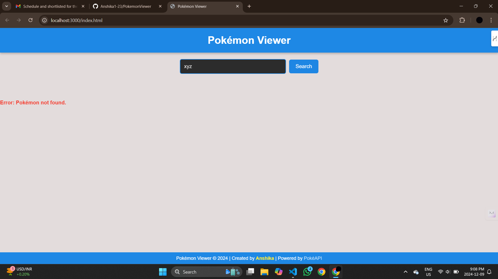

# Pokémon Viewer

## Project Overview
The **Pokémon Viewer** is a sleek and dynamic web application that allows users to:
- View the first 50 Pokémon with their names, images, and basic details.
- Search for specific Pokémon by name.
- Handle errors gracefully, such as when a resource fails to load or a Pokémon is not found.

The application leverages the **PokéAPI** to fetch Pokémon data and is built using **HTML**, **CSS**, and **JavaScript**, styled with a modern **blue and black theme**.

---

## Features
### 1. Pokémon List
- Displays the first 50 Pokémon fetched from the PokéAPI.
- Includes Pokémon names, images, and cards styled for easy readability.

### 2. Search Functionality
- Users can search for Pokémon by name using the search bar.
- Displays matching Pokémon with details or an error message if not found.

### 3. Error Handling
- **Resource Not Loaded**: Displays an error message if the API fails to load.
- **Pokémon Not Found**: Shows a user-friendly notification when a searched Pokémon does not exist.

---

## Technologies Used
- **Frontend**: HTML, CSS, JavaScript
- **API**: [PokéAPI](https://pokeapi.co/)
- **Styling**: CSS with a modern blue and black theme

---

## Installation
Follow these steps to run the Pokémon Viewer locally:

1. Clone the repository:
   ```bash
   git clone https://github.com/Anshika1-23/PokemonViewer.git
   cd pokemon-viewer
2. Open index.HTML

---

## Screenshots

### 1. Pokémon List
  
A list of the first 50 Pokémon displayed with their images and names in a modern card format.

### 2. Search Feature
  
The search bar with results displayed dynamically or an error message if the Pokémon isn't found.

### 3. Error Handling
  
Error messages shown for issues like a missing Pokémon or API failure.

---

## Acknowledgements
- PokéAPI: For providing the Pokémon data.
- Developed with 💙 by Anshika.
